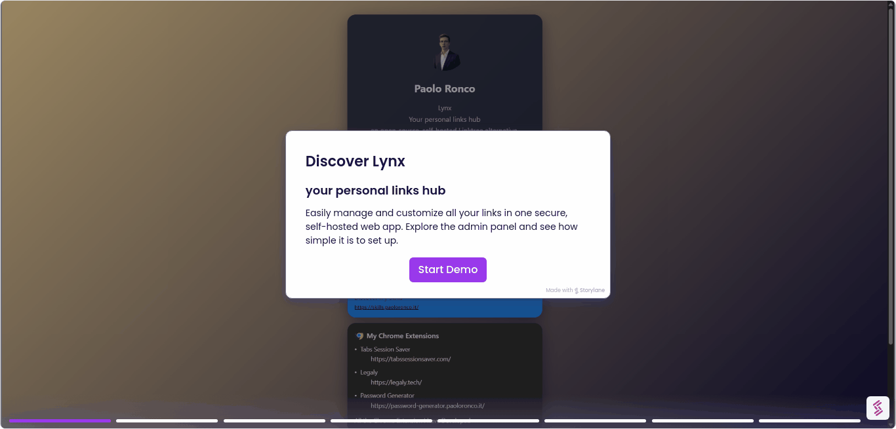

# Lynx

### Your personal links hub

[](https://github.com/paoloronco/Lynx)

<a href="https://www.producthunt.com/products/github-182?embed=true&utm_source=badge-featured&utm_medium=badge&utm_source=badge-lynx&#0045;6" target="_blank"></a>

**Lynx** is an open-source, self-hosted link manager that helps you gather all your digital touchpoints in a single page, with secure authentication and a fully customizable design.

---

# 📑 Table of Contents  

1. [Lynx](#lynx)  
   - [🧪 Demo](#-demo)  
   - [✨ Features](#-features)  
   - [🔒 Security Features](#-security-features)  
   - [🛠 Tech Stack](#-tech-stack)   
   - [🎥 Video](#-video)  
2. [🚀 Quick Start](#-quick-start)  
   - [1. Clone, Install & Run](#1-clone-install--run)  
   - [2. 🚀 Deploy on Railway](#2--deploy-on-railway)  
   - [3. 🚀 Deploy on Render](#2--deploy-on-render)  
   - [3. 🚀 Other alternatives to deploy it](#3--other-alteratives-to-deploy-it)  
3. [📝 Changelog](#-changelog)  
4. [📌 To-Do / Next Steps](#-to-do--next-steps)  
5. [👨‍💻 Developed With](#-developed-with)  
6. [📜 License](#-license)  

---

## 🧪 Demo

- 🌐 [Try Lynx Demo on Railway](https://lynx-demo.up.railway.app/)  
- **Admin Panel**: [https://lynx-demo.up.railway.app/admin](https://lynx-demo.up.railway.app/admin)  
- **Login**:  
  - User: `admin`  
  - Password: `demo123` (the password can't be changed)

⚠️ This demo runs on a free Railway plan.  
The database resets automatically every 15 minutes.


## ✨ Features

* 📝 **Customizable** → themes, colors, fonts, and layouts
* 🔐 **Secure Authentication** → bcryptjs password hashing + JWT tokens
* 🛠 **Admin Panel** → manage links, themes, profile, and settings
* 🗂 **Standalone** → no Firebase, Supabase, or external DBs
* 🚀 **Deploy Anywhere** → Render, Railway, Docker, Linux Server, Heroku, GCP, DigitalOcean, Fly.io
* 📱 **Mobile Responsive** → optimized for all devices
* 🗄 **SQLite Database** → self-contained, file-based storage

### 🔒 Security Features

* Password Hashing: bcryptjs (12 salt rounds)
* JWT Authentication: signed tokens (7-day expiry)
* Database Safety: parameterized queries against SQLite
* Session Security: cookies set HttpOnly and SameSite

---

## 🛠 Tech Stack

  
  
  
  
  
  

---

## 🎥 Video

#### Lynx Demo
[](https://app.storylane.io/share/tjpm3tey6ven)

#### How to deploy Lynx
[](https://www.youtube.com/watch?v=x1MVY4vreOk)


---

## 🚀 Quick Start

Credentials:
  User: `admin`
Password: `ChangeMe123!`

### 1. Clone, Install & Run

*(prerequisite: Node.js 18+)*
  ```bash
    git clone https://github.com/paoloronco/Lynx.git
    cd Lynx
    npm install
    npm run build
    cd server
    npm install
    cd ..
    npm run start
  ```

<p> Public → http://localhost:5173
<p> Admin → http://localhost:5173/admin

### 2. 🚀 Deploy on Railway

You can deploy **Lynx** on [Railway](https://railway.com) in a few steps:
1. Go to **Railway Dashboard** → New → **GitHub Repo**
2. Connect **GitHub repo (Lynx)**
3. Set the following commands:
   - **Build Command**
     ```bash
     npm install && npm run build && cd server && npm install
     ```
   - **Start Command**
     ```bash
     npm run start
     ```
4. Click **Create** and wait for the deployment ✨
5. Add a public domain in the settings 

### 3. 🚀 Deploy on Render

You can deploy **Lynx** on [Render](https://render.com) in a few steps:

0. Fork this repo (recommended)
1. Go to **Render Dashboard → New → Web Service**
2. Connect **GitHub repo (Lynx)**
3. Set the following commands:
   - **Build Command**
     ```bash
     npm install && npm run build && cd server && npm install
     ```
   - **Start Command**
     ```bash
     npm run start
     ```
4. Click **Create Web Service** and wait for the deployment ✨

Your app will be available at a URL like: https://your-app.onrender.com


### 4. 🚀 Other alternatives to deploy it:

- [DigitalOcean App Platform](https://www.digitalocean.com/products/app-platform)  
- [Fly.io (Docker)](https://fly.io/docs/)  
- [Heroku (Container)](https://devcenter.heroku.com/articles/container-registry-and-runtime)  
- [Google Cloud Run (Container)](https://cloud.google.com/run/docs/deploying)  
- [Vercel (Node.js / Static)](https://vercel.com/docs)  
- [Netlify (Static + Functions)](https://docs.netlify.com/)  
- [AWS Elastic Beanstalk](https://docs.aws.amazon.com/elasticbeanstalk/)  
- [Azure App Service](https://learn.microsoft.com/en-us/azure/app-service/)  
- [Koyeb (Serverless Containers)](https://www.koyeb.com/docs)  
- [CapRover (Self-hosted PaaS)](https://caprover.com/docs/)  
- [Dokku (Self-hosted PaaS)](https://dokku.com/docs/getting-started/)  
- [Coolify (Self-hosted PaaS)](https://coolify.io/docs)  
- [Northflank](https://northflank.com/docs)  
- [Qovery](https://hub.qovery.com/)  
- [Cyclic.sh](https://docs.cyclic.sh/)  
- [Glitch](https://glitch.com/)  
- [Replit](https://docs.replit.com/)  
- [Stormkit](https://stormkit.io/docs)  
- [Appwrite (Functions/Containers)](https://appwrite.io/docs)  
- [Supabase (Edge Functions)](https://supabase.com/docs/guides/functions)  

---

## 📝 Changelog

### v3.2.1

### 🔧 Admin
- Interface title updated to: **“Lynx - Your personal links hub”**
- **Profile**
  - Bio now supports **line breaks** (`whitespace-pre-line`)
  - Empty bio is automatically hidden (no blank space left)
  - Social links work properly → hidden if empty
- **Links**
  - Text color is now applied consistently across the entire card (title, description, URL)
  - Improved **Text Card** rendering: each link is displayed on two lines
    → Name on top, URL below (indented with horizontal scroll for long URLs)
  - Bug fixes in rendering icons, removing cards, and updating links
  - Bug fix: image/emoji next to link not working
  - Ability to export/import Links as Json
- **Theme**
  - Removed duplicate *“Content”* tab (was a duplicate of name + bio)
  - **Export/Import** now correctly saves and restores themes
- **UI**
  - Footer updated to:  
    `Powered by Lynx | Lynx - Your personal links hub`


### 🚀 Demo
- Demo is fully functional, but **password change is disabled**


---
## 📌 To-Do / Next Steps

### 🔧 Admin
- **Profile**
  - Option to resize (enlarge/reduce) the profile image
  - Option to choose the placement of profile elements (name, bio, avatar, etc.)
  - Bug fix: profile picture not working
- **Links**
  - Ability to center text and customize its alignment within cards
- **Themes**
  - Further improvements to theme usability and customization
  - Enhanced personalization options for layouts, colors, and styles
- **Code**
  - Code cleaning & refactoring: removing unnecessary parts, obsolete code, and unused dependencies (e.g., leftover Supabase or Firebase integrations).

---

👨‍💻 Developed With

* ChatGPT
* Claude
* Lovable

---

📜 License

MIT License

Copyright (c) 2025 Paolo Ronco

Permission is hereby granted, free of charge, to any person obtaining a copy
of this software and associated documentation files (the "Software"), to deal
in the Software without restriction, including without limitation the rights
to use, copy, modify, merge, publish, distribute, sublicense, and/or sell
copies of the Software, and to permit persons to whom the Software is
furnished to do so, subject to the following conditions:

The above copyright notice and this permission notice shall be included in all
copies or substantial portions of the Software.

THE SOFTWARE IS PROVIDED "AS IS", WITHOUT WARRANTY OF ANY KIND, EXPRESS OR
IMPLIED, INCLUDING BUT NOT LIMITED TO THE WARRANTIES OF MERCHANTABILITY,
FITNESS FOR A PARTICULAR PURPOSE AND NONINFRINGEMENT. IN NO EVENT SHALL THE
AUTHORS OR COPYRIGHT HOLDERS BE LIABLE FOR ANY CLAIM, DAMAGES OR OTHER
LIABILITY, WHETHER IN AN ACTION OF CONTRACT, TORT OR OTHERWISE, ARISING FROM,
OUT OF OR IN CONNECTION WITH THE SOFTWARE OR THE USE OR OTHER DEALINGS IN THE
SOFTWARE.

