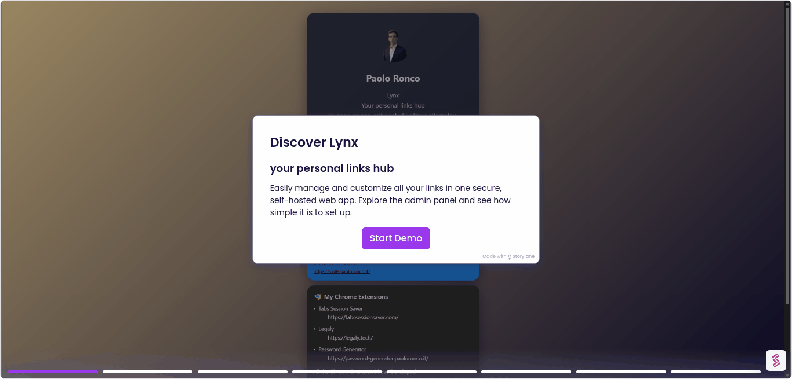

# Lynx

### Your personal links hub

[](https://github.com/paoloronco/Lynx)

**Lynx** is an open-source, self-hosted link manager that helps you gather all your digital touchpoints in a single page, with secure authentication and a fully customizable design.

---

# 📑 Table of Contents  

1. [Lynx](#lynx)  
   - [🎥 Video](#-video)  
   - [🧪 Demo](#-demo) 
   - [✨ Features](#-features)  
   - [🔒 Security Features](#-security-features)  
   - [🛠 Tech Stack](#-tech-stack)   
2. [🚀 Quick Start](#-quick-start)  
   - [1. Clone, Install & Run](#1-clone-install--run)  
   - [2. 🚀 Deploy with Docker](#2--deploy-with-docker)  
   - [3. 🚀 Deploy on Railway](#2--deploy-on-railway)  
   - [4. 🚀 Other alternatives to deploy it](#3--other-alteratives-to-deploy-it)  
3. [📝 Changelog](#-changelog)  
4. [📌 To-Do / Next Steps](#-to-do--next-steps)  
5. [👨‍💻 Developed With](#-developed-with)  
6. [📜 License](#-license)  

---
## 🎥 Video

#### Lynx Demo
[](https://app.storylane.io/share/tjpm3tey6ven)

## 🧪 Demo

- 🌐 [Try Lynx Demo on CloudRun] [https://lynx-demo.paoloronco.it](https://lynx-demo.paoloronco.it/)]
- **Admin Panel**: [[https://lynx-demo.paoloronco.it/admin](https://lynx-demo.paoloronco.it/admin)]
- **Login**:  
  - User: `admin`  
  - Password: `ChangeMe123!` (the password can't be changed)

⚠️ The database resets automatically every 15 minutes.

---

## ✨ Features

* 🎨 Full Customization → personalize colors, themes, fonts, text alignment, and layouts.
* 📇 Flexible Link Management → create classic links, bulleted lists, or text cards (full-card clickable).
* 🖼 Rich Media Support → add icons, emojis, or images to your links.
* 🛠 Admin Dashboard → manage profile, links, and themes in a clean UI.
* 👁 Live Preview → real-time preview of your public page directly inside the admin panel.
* 🙈 Link Visibility Toggle → hide/show links without deleting them; hidden links are invisible to visitors.
* 📱 Mobile Drag & Drop → reorder links via touch on any mobile device.
* 📦 Import/Export → backup and restore links & themes in JSON with one click.
* 🌍 Deploy Anywhere → easy setup on Railway, Render, Docker, GCP, DigitalOcean, Fly.io, and more.
* 📱 Mobile-First → responsive design that looks great on any device.
* 🗄 Standalone by Design → lightweight, no Firebase/Supabase required.
* ⚡ Fast & Modern → built with Vite, React, and Tailwind CSS.
* 🔒 **Built-in HTTPS support** → enable automatic SSL (self-signed) by setting `ENABLE_HTTPS=true`, runs alongside HTTP on port `8443`.

### 🔒 Security Features

* 🔑 Password Security → bcryptjs hashing (12 salt rounds).
* 🛡 Token-Based Auth → JWT with signed tokens (12-hour expiry).
* 💾 Database Protection → parameterized queries for SQLite, preventing SQL injection.
* 🔐 Safe Sessions → token stored encrypted (AES-GCM) in localStorage; no cookies used, eliminating CSRF attack surface.
* 🔍 Code Transparency → fully open-source for audits and improvements.

---

## 🛠 Tech Stack

<p align="center">       </p>

---

## 🚀 Quick Start

Credentials:
  User: `admin`
  Password: `ChangeMe123!`

<details>
  <summary><h3>1. Clone, Install & Run(click to expand)</h3></summary>

  *(prerequisite: Node.js 18+)*
  ```bash
    git clone https://github.com/paoloronco/Lynx.git
    cd Lynx/LYNX
    npm install
    npm run build
    cd server
    npm install
    cd ..
    npm run start
  ```

> Public → http://localhost:3001

> Admin → http://localhost:3001/admin
HTTPS (optional) → https://localhost:8443
 (requires ENABLE_HTTPS=true)
</details>


<details>
  <summary><h3>2. 🚀 Deploy with Docker</h3></summary>

You can run **Lynx** directly using the pre-built image from [Docker Hub](https://hub.docker.com/r/paueron/lynx).

1. Pull the image
    ```bash
    docker pull paueron/lynx:latest
    ```
2. Start the container
    ```bash
    docker run -d --name lynx \
      -p 8080:8080 \
      -p 8443:8443 \
      -e NODE_ENV=production \
      -e PORT=8080 \
      -e JWT_SECRET="your-very-secret-key" \
      -e ENABLE_HTTPS=true \
      -v lynx_data:/app/data \
      paueron/lynx:latest
    ```
    > ⚠️ Since version v3.5.0, the container requires a JWT_SECRET to start.
    If it’s missing, startup will fail with an error message to prevent insecure sessions.

    Once started, the app will be available at:
    > 🌐 HTTP → http://localhost:8080
    > 🔒 HTTPS → https://localhost:8443
      (self-signed certificate)

    > 👉 http://localhost:8080/admin

3. Optional environment variables
    - JWT_SECRET – secret key used to sign JWT tokens. If not set, a random key will be generated at runtime (⚠️ highly recommended to set this in production).

    - PORT – the internal server port (default: 8080).

    - NODE_ENV – Node.js environment (default: production).
</details>

<details>
  <summary><h3>2. 🚀 Deploy on Railway</h3></summary>

You can deploy **Lynx** on [Railway](https://railway.com) in a few steps:
1. Go to **Railway Dashboard** → New → **GitHub Repo**
2. Connect **GitHub repo (Lynx)**
3. Set the following commands:
   - **Build Command**
     ```bash
     cd LYNX && npm install && npm run build && cd server && npm install
     ```
   - **Start Command**
     ```bash
     cd LYNX && npm run start
     ```
4. Add environment variables:
     ```bash
    NODE_ENV=production
    PORT=8080
    JWT_SECRET=your-very-secret-key
    ENABLE_HTTPS=true
    ```
5. Click **Create** and wait for the deployment ✨
6. Add a public domain in the settings 

</details>

<details>
  <summary><h3>4. 🚀 Other alternatives to deploy it:</h3></summary>


- [Render](https://render.com/)
- [DigitalOcean App Platform](https://www.digitalocean.com/products/app-platform)  
- [Fly.io (Docker)](https://fly.io/docs/)  
- [Heroku (Container)](https://devcenter.heroku.com/articles/container-registry-and-runtime)  
- [Google Cloud Run (Container)](https://cloud.google.com/run/docs/deploying)  
- [Vercel (Node.js / Static)](https://vercel.com/docs)  
- [Netlify (Static + Functions)](https://docs.netlify.com/)  
- [AWS Elastic Beanstalk](https://docs.aws.amazon.com/elasticbeanstalk/)  
- [Azure App Service](https://learn.microsoft.com/en-us/azure/app-service/)  
- [Koyeb (Serverless Containers)](https://www.koyeb.com/docs)  
- [CapRover (Self-hosted PaaS)](https://caprover.com/docs/)  
- [Dokku (Self-hosted PaaS)](https://dokku.com/docs/getting-started/)  
- [Coolify (Self-hosted PaaS)](https://coolify.io/docs)  
- [Northflank](https://northflank.com/docs)  
- [Qovery](https://hub.qovery.com/)  
- [Cyclic.sh](https://docs.cyclic.sh/)  
- [Glitch](https://glitch.com/)  
- [Replit](https://docs.replit.com/)  
- [Stormkit](https://stormkit.io/docs)  
- [Appwrite (Functions/Containers)](https://appwrite.io/docs)  
- [Supabase (Edge Functions)](https://supabase.com/docs/guides/functions)  
</details>

---

## 📝 Changelog

### v3.6.0

#### ✨ New Features
* **Live Preview tab** → new Preview tab in the admin panel renders a real-time scaled preview of your public page (profile, links, and theme) without leaving the dashboard.
* **View Public Page button** → quick-access button in the admin header opens the public page in a new tab instantly.
* **Link visibility toggle** → hide/show any link or card without deleting it. Hidden links are dimmed in the admin list and invisible to public visitors. Uses the existing `is_active` database column.
* **Mobile drag & drop** → reordering links now works on touch screens via native touch events (`touchstart`/`touchmove`/`touchend`), no external libraries required.

#### 🔒 Security & Code Quality
* **Removed sensitive production logs** → `authenticateUser` no longer logs password hashes, salts, or bcrypt internals to stdout in any environment.
* **Removed dead Supabase/Firebase code** → deleted `src/integrations/supabase/` and `src/lib/supabase-data.ts`; reduces bundle size and eliminates confusion.
* **Fixed duplicate database migration** → `ALTER TABLE` for `title_font_size` and `description_font_size` was silently executed twice; deduplicated.
* **Removed debug console.log from `PublicLinkCard`** → no longer prints link data on every render.

#### 🔧 Improvements
* Admin `GET /api/links` returns **all links** (including hidden) when called with a valid JWT; public requests still receive only active links.
* `is_active` flag is now correctly persisted on save (previously always forced to `1`).
* Tab labels collapse to icon-only on mobile to accommodate the new Preview tab.
* Typo fixed: "Add bulled list" → "Add bulleted list".

---

### v3.5.1

#### 🔒 Security Updates
* **All security vulnerabilities resolved**
  - Fixed all runtime vulnerabilities (multer, express, react-router-dom)
  - Fixed all build-time vulnerabilities (tar, minimatch, glob, cross-spawn)
  - Updated system packages in Docker images
  - Security audit: 0 vulnerabilities detected in frontend & backend
  - Resolves GitHub Dependabot alerts #18-36 and all DockerHub CVEs

#### 🚀 Performance
* **Docker build optimization**
  - Build time reduced from 18+ minutes to ~2 seconds
  - Removed `--build-from-source` flag for faster npm installations
  - Uses precompiled binaries for better reliability

#### 🔧 Improvements
* Added `.claude/` to `.gitignore` and `.dockerignore`
* Set `PORT=8080` environment variable in Docker for consistency
* Updated `SECURITY.md` with comprehensive security information

### v3.5.0

### 🔧 Admin
* Updated title to: “Lynx – Your personal links hub”
* **Profile**
  - Bio now supports **line breaks** (`whitespace-pre-line`)
  - Empty bio is automatically hidden (no blank space left)
  - Social links are hidden when empty
  - Profile picture now displays correctly
* **Links**
  - Consistent text color applied across title, description, and URL
  - Improved Text Card rendering: Link name on the first line, URL on the second line (with horizontal scroll for long URLs)
  - Added support for image/emoji next to links
  - Added ability to insert either: 
    * Text Card → full card with only text, entire card clickable via a single link
    * Bulleted List → list with a title and multiple links underneath
  - Option to export/import links as JSON
  - Bug fixes in rendering icons, removing cards, and updating links
  - Fixed bugs with icons, card removal, and link updates
  - Extended customization: choose font, size, and alignment for links
* **Theme**
  - Removed duplicate “Content” tab (was redundant with name + bio)
  - Partially removed Typography tab → now integrated into Links and Profile sections for better UX
  - Export/Import now properly saves and restores themes
* **UI**
  - Updated footer to:
    `Powered by Lynx | Lynx - Your personal links hub`
  - Possibility to change the `title` and `meta description`
* **Docker / Deployment**
  - Added startup check for JWT_SECRET:
    the container will now fail to start if the environment variable JWT_SECRET is missing.
    This ensures proper JWT token signing and prevents session invalidation on restart.
    Example usage:
    ```bash
    docker run -d -p 8080:8080 -e JWT_SECRET="your-strong-random-secret" paueron/lynx:latest
    ```
  - **Built-in HTTPS support** → enable automatic SSL (self-signed) by setting `ENABLE_HTTPS=true`, runs alongside HTTP on port `8443`.
  
---
## 📌 To-Do / Next Steps

### 🔧 Admin
- Analytics: click counters per link with a chart in the admin panel (recharts already included).
- More social icons: YouTube, TikTok, Discord, Telegram, WhatsApp.
- Link scheduler: auto show/hide links based on a date range.
- Section separators: visual dividers to group links with a heading.
- "Copy link" button on public cards.

---

👨‍💻 Developed With

* ChatGPT
* Claude

---

📜 License

MIT License

Copyright (c) 2025 Paolo Ronco

Permission is hereby granted, free of charge, to any person obtaining a copy
of this software and associated documentation files (the "Software"), to deal
in the Software without restriction, including without limitation the rights
to use, copy, modify, merge, publish, distribute, sublicense, and/or sell
copies of the Software, and to permit persons to whom the Software is
furnished to do so, subject to the following conditions:

The above copyright notice and this permission notice shall be included in all
copies or substantial portions of the Software.

THE SOFTWARE IS PROVIDED "AS IS", WITHOUT WARRANTY OF ANY KIND, EXPRESS OR
IMPLIED, INCLUDING BUT NOT LIMITED TO THE WARRANTIES OF MERCHANTABILITY,
FITNESS FOR A PARTICULAR PURPOSE AND NONINFRINGEMENT. IN NO EVENT SHALL THE
AUTHORS OR COPYRIGHT HOLDERS BE LIABLE FOR ANY CLAIM, DAMAGES OR OTHER
LIABILITY, WHETHER IN AN ACTION OF CONTRACT, TORT OR OTHERWISE, ARISING FROM,
OUT OF OR IN CONNECTION WITH THE SOFTWARE OR THE USE OR OTHER DEALINGS IN THE
SOFTWARE.

