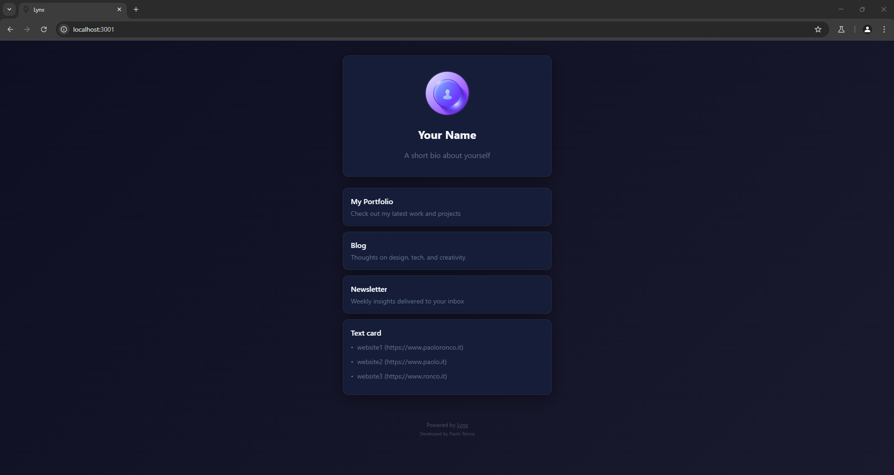
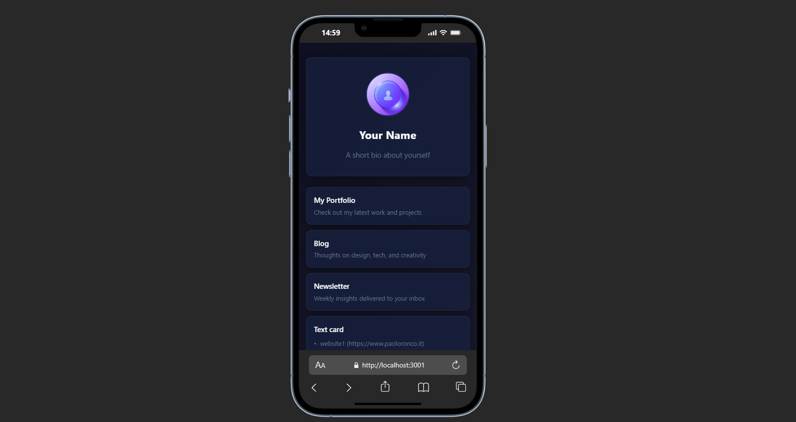
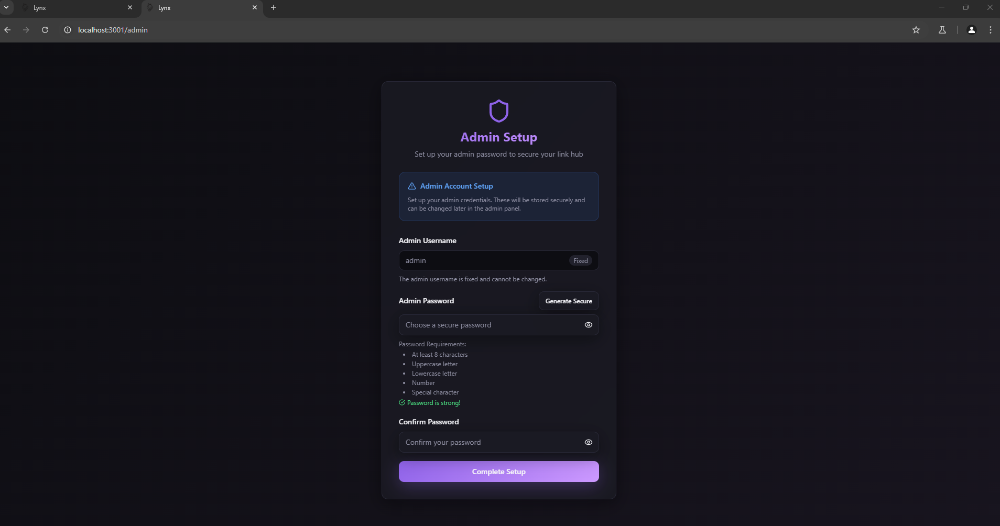
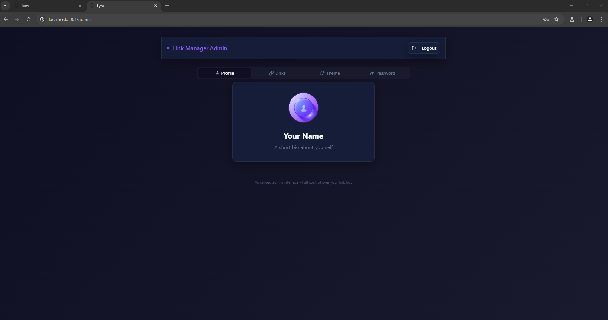
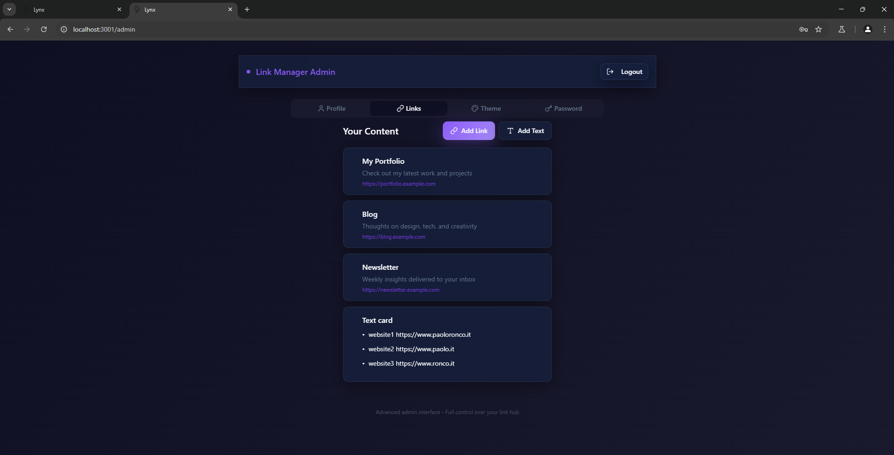
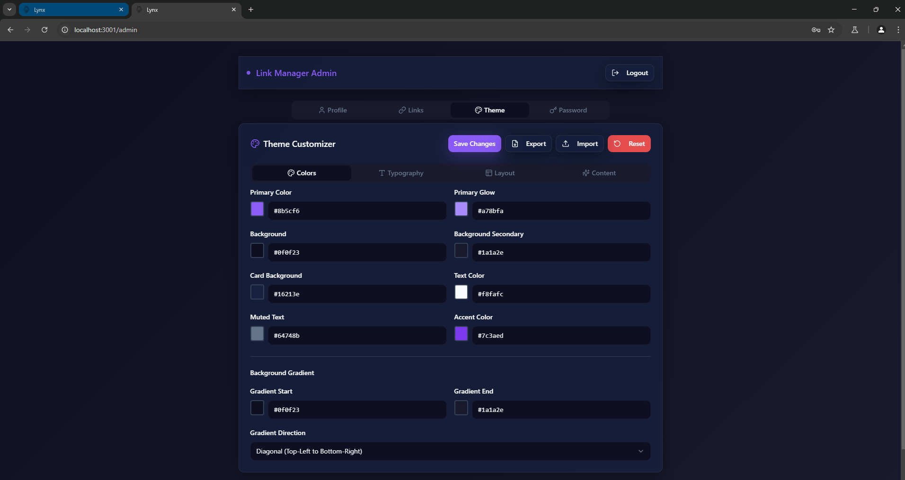
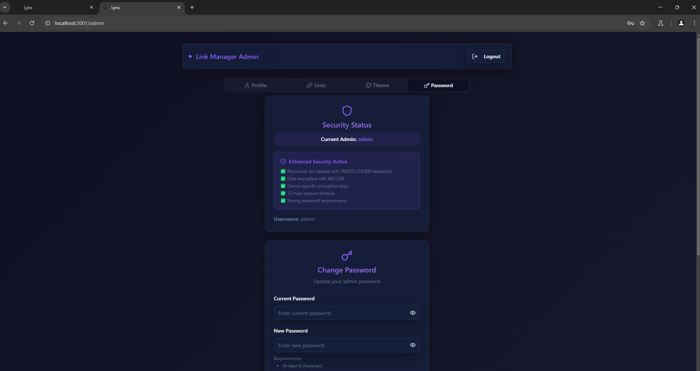

# Lynx

### Your personal links hub

[](https://github.com/paoloronco/Lynx)

**Lynx** is an open-source, self-hosted link manager that helps you gather all your digital touchpoints in a single page, with secure authentication and a fully customizable design.

* * *

## ✨ Features

* 🗂 **Standalone** → no Firebase, Supabase, or external DBs
* 🗄 **SQLite Database** → self-contained, file-based storage
* 🔐 **Secure Authentication** → bcryptjs password hashing + JWT tokens
* 🛠 **Admin Panel** → manage links, themes, profile, and settings
* 🎨 **Full Customization** → themes, colors, fonts, and layouts
* 🚀 **Deploy Anywhere** → Vercel, Docker, Linux server, Heroku

* * *

### 🔒 Security Features

* Password Hashing: bcryptjs (12 salt rounds)
* JWT Authentication: signed tokens (7-day expiry)
* Database Safety: parameterized queries against SQLite
* Session Security: cookies set HttpOnly and SameSite

* * *

## 📝 Next Steps & ToDo

### Admin → Links

* [ ] Fix background color, text color, emoji/icon, and size options → currently not working.
* [ ] Fix the **Text Card**:
  * cannot be deleted
  * “Additional text content” is not saved or displayed
  * same styling problems as normal cards

### Admin → Theme

* [ ] Improve the theme system:
  * themes can be customized but still have bugs
  * changes currently apply only to the public page → they should also update the admin interface

### Admin → Profile

* [ ] If the bio is empty, hide it automatically and adjust the profile card layout so it doesn’t leave blank space.

### Admin → Reset

* [ ] Rename the button **“Reset Authentication”** to simply **“Reset”**.
* [ ] Make the reset button fully reset the application:
  * clear account
  * clear links
  * clear profile
  * clear themes
  * bring the app back to the initial installation state

* * *

## 🛠 Tech Stack

  
  
  
  
  
  

* * *

## 📸 Screenshots

  
*Public page displaying profile and all links.*

  
*Public page mobile view.*

  
*Initial setup screen to create the admin password.*

  
*Admin profile section to edit name and bio.*

  
*Admin links manager to add, edit, and organize links or text cards.*

  
*Theme customizer for colors, layout, and styles.*

  
*Password & security panel with change password and reset options.*

* * *

## 🚀 Quick Start

### 1. Clone, Install & Run

*(prerequisite: Node.js 18+)*

    git clone https://github.com/paoloronco/Lynx.git
    cd Lynx
    npm ci
    cd server
    npm ci
    cd ..
    npm start

<p> Public → http://localhost:5173
<p> Admin → http://localhost:5173/admin

### 2. 🚀 Deploy on Render

You can deploy **Lynx** on [Render](https://render.com) in a few steps:

0. Fork this repo
1. Go to **Render Dashboard → New → Web Service**
2. Connect **GitHub repo (Lynx)**
3. Set the following commands:
   - **Build Command**
     ```bash
     bun install && bun run build && cd server && bun install
     ```
   - **Start Command**
     ```bash
     bun run start
     ```
4. Click **Create Web Service** and wait for the deployment ✨

Your app will be available at a URL like:  

* * *

👨‍💻 Developed With

* ChatGPT
  
* Claude
  
* Lovable
  

* * *

📜 License

This project is licensed under the MIT License.
Free to use, share, and modify.
